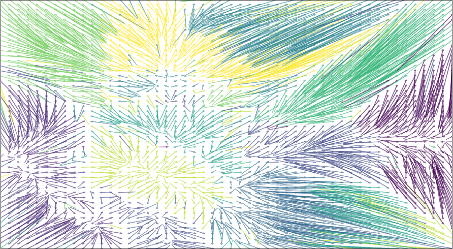

[](https://github.com/src-d/lapjv/actions) [](https://pypi.python.org/pypi/lapjv)

Linear Assignment Problem solver using Jonker-Volgenant algorithm
==================================================================

This project is the rewrite of [pyLAPJV](https://github.com/hrldcpr/pyLAPJV) which
supports Python 3 and updates the core code. The performance is twice as high as
the original thanks to the optimization of the augmenting row reduction phase
using Intel AVX2 intrinsics. It is a native Python 3 module and does
not work with Python 2.x, stick to pyLAPJV otherwise.

[](http://web.archive.org/web/20180611012448/https://blog.sourced.tech/post/lapjv//)

[Linear assignment problem](https://en.wikipedia.org/wiki/Assignment_problem)
is the bijection between two sets with equal cardinality which optimizes the sum
of the individual mapping costs taken from the fixed cost matrix. It naturally
arises e.g. when we want to fit [t-SNE](https://lvdmaaten.github.io/tsne/) results
into a rectangular regular grid.
See this awesome notebook for the details about why LAP matters:
[CloudToGrid](https://github.com/kylemcdonald/CloudToGrid/blob/master/CloudToGrid.ipynb).

Jonker-Volgenant algorithm is described in the paper:

R. Jonker and A. Volgenant, "A Shortest Augmenting Path Algorithm for Dense and Sparse Linear Assignment Problems," _Computing_, vol. 38, pp. 325-340, 1987.

This paper is not publicly available though a brief description exists on
[sciencedirect.com](http://www.sciencedirect.com/science/article/pii/S0166218X99001729).
JV is faster in than the [Hungarian algorithm](https://en.wikipedia.org/wiki/Hungarian_algorithm) in practice,
though the complexity is the same - O(n<sup>3</sup>).

The C++ source of the algorithm comes from http://www.magiclogic.com/assignment.html
It has been reworked and partially optimized with OpenMP 4.0 SIMD.

Installing
----------
```
pip3 install lapjv
```
Tested on Linux and macOS.

Usage
-----
Refer to [test.py](test.py) for the complete code.

```
from lapjv import lapjv
row_ind, col_ind, _ = lapjv(cost_matrix)
```

The assignment matrix by row is `row_ind`: the value at n-th place is the assigned column index to the n-th row.
`col_ind` is the reverse of `row_ind`: mapping from columns to row indexes.

Note: a bijection is only possible for sets with equal cardinality. If you need to map A vectors to B vectors,
derive the square symmetric (A+B) x (A+B) matrix: take the first A rows and columns from A and
the remaining [A..A+B] rows and columns from B. Set the A->A and B->B costs to some maximum distance value,
big enough so that you don't see assignment errors.

Illegal instruction
-------------------

This error appears if your CPU does not support the AVX2 instruction set. We do not ship builds for different CPUs so you need to build the package yourself:

```
pip3 install git+https://github.com/src-d/lapjv
```

NAN-s
-----

NAN-s in the cost matrix lead to completely undefined result. It is the caller's responsibility to check them.

License
-------
MIT Licensed,see [LICENSE](LICENSE)
